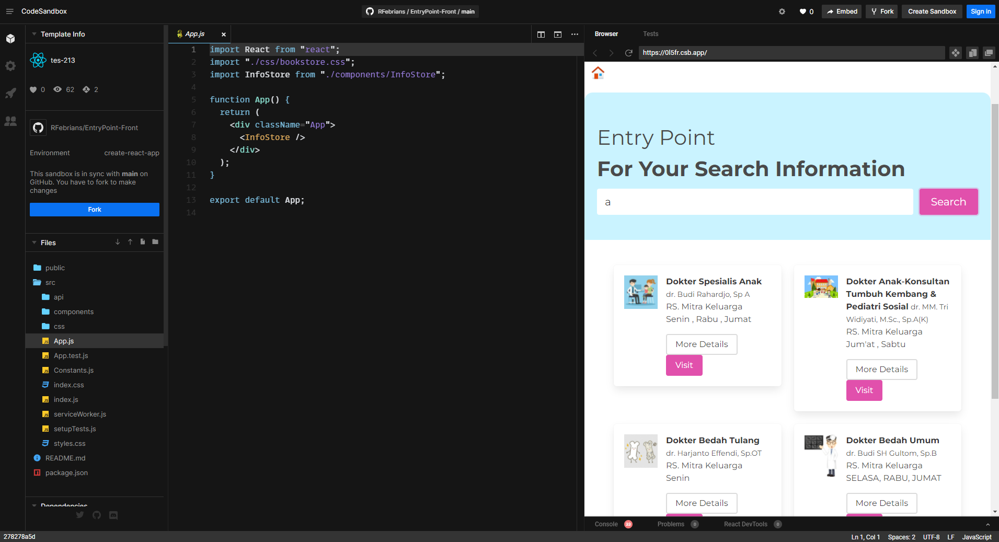

# EntryPoint-Front
A prototype front end created using create-react-app .

## From this prototype you can learn about :

- Create a List Card
- Create a search bar (text box)
- How to Connect React with Backend
- Learn to built a Frontend Schema

## Live Playground

Experiment your live project with Codesandbox 

 

## Deployment

See History Deployment : https://github.com/RFebrians/search-engine-react/deployments/activity_log?environment=Production

Or Vercel Dashboard (You may need Login to see this status) 

https://vercel.com/rfebrians/entry-point-front/4Xp5qaYttKYefG9UxhwHN7XbTPL2

## Backend Info

- Deployment : 

- Repository : 

